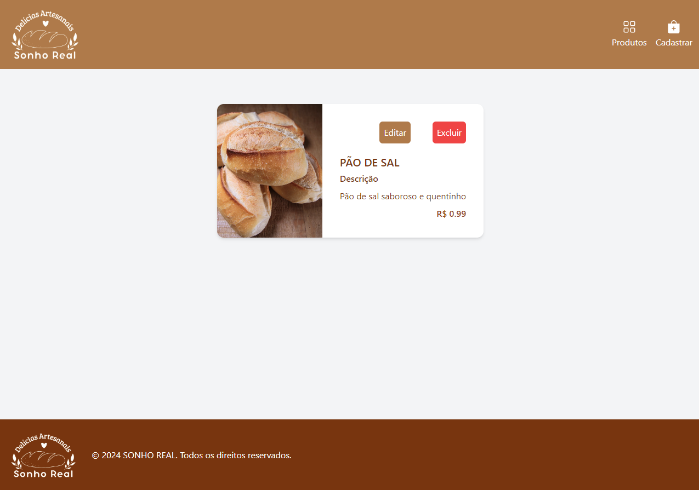

Projeto utilizando nodejs/handlebars/tailwind onde simula um catalogo de uma padaria (tendo a possibilidade de realizar o CRUD dos produtos)

VISÃO DA TELA DE CADASTRO

VISÃO DA TELA DE LISTAGEM DOS PRODUTOS

VISÃO DA TELA DE ATUALIZAÇÃO DO PRODUTO

Dependências que precisam ser instaladas para o funcionamento do projeto:
- npm install express –save
- npm install body-parser --save  
- npm install express-handlebars –save
- npm i express-fileupload
- npm install @tailwindcss/forms
- npm install tailwindcss
- npm install firebase
- npm install firebase-admin

